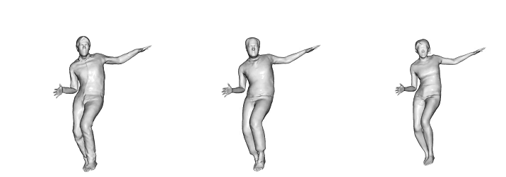

# SCANimate: Weakly Supervised Learning of Skinned Clothed Avatar Networks (CVPR 2021 Oral)

[](https://arxiv.org/pdf/2104.03313)

This repository contains the official PyTorch implementation of:

**SCANimate: Weakly Supervised Learning of Skinned Clothed Avatar Networks** <br>*Shunsuke Saito, Jinlong Yang, Qianli Ma, and Michael J. Black* <br>[Full paper](https://arxiv.org/pdf/2104.03313.pdf) | [5min Presentation](https://youtu.be/EeNFvmNuuog) | [Video](https://youtu.be/ohavL55Oznw) | [Project website](https://scanimate.is.tue.mpg.de/) | [Poster](https://scanimate.is.tue.mpg.de/media/upload/poster/CVPR_poster_SCANimate.pdf)




## Installation
Please follow the instructions in `./installation.txt` to install the environment and the SMPL model.

## Run SCANimate
**0. Activate the environment if it is not already activated:**
```sh
$ source ./venv/scanimate/bin/activate
```

**1. First download the pretrained model, some motion sequences and other files for the demo**

- Download an AIST++ dance motion sequence for test (CC BY 4.0 license):

```sh
$ . ./download_aist_demo_motion.sh
```
​		This script will create a `data` folder under current directory, please make sure to put it under the `SCANimate` directory.

- Download pre-trained scanimats for animation test:
  Please visit https://scanimate.is.tue.mpg.de/download.php, register, login, read and agree to the license and then download some demo scanimats.
  Unzip the zip file into `./data` directory

- Download subset of CAPE data for training demo:
  Please visit https://scanimate.is.tue.mpg.de/download.php, register, login, read and agree to the license and then download the data for training demo.
  Unzip the zip file into `./data` directory.

- Now you should have a `./data` directory under `SCANimate`. Within `./data` you will have 5 directories: `minimal_body`, `pretrained`, `pretrained_configs`, `test`, and `train`.


### Run animation demos:
**2. Now you can run the test demo with the following command:**

```sh
$ python -m apps.test_scanimate -c ./data/pretrained_configs/release_03223_shortlong.yaml -t ./data/test/gLO_sBM_cAll_d14_mLO1_ch05
```
- You can replace the configuration file with other files under `./data/pretrained_configs/` to try other subjects.
- You can also replace the test motions with others under `./data/test`.
- The result will be generated under `./demo_result/results_test`.

**3. The generated mesh sequences can be rendered with the code under `./demo_result`**:

First, install Open3D (for rendering the results) by:

```sh
$ pip install open3d==0.12.0
```

Then run:

```sh
$ python render/render_aist.py -i demo_result/results_test/release_03223_shortlong_test_gLO_sBM_cAll_d14_mLO1_ch05/ -o demo_result
```
### Run training demo
**2. Now you can run the demo training with**
```sh
$ python -m apps.train_scanimate -c ./configs/example.yaml
```
The results can be found under `./demo_result/results/example`.

**3. Train on your own data**
Make your data the same structure as in the `./data/train/example_03375_shortlong`, where a `.ply` file contains a T-pose SMPL body mesh and a folder containing training frames.
Each frame corresponds to two files: one `.npz` files containing SMPL parameters that describes the pose of the body (i.e. only 'transl' and 'pose' matters) and one `.ply` file containing the clothed scan. The body should align with the scan.
Then, change the `./configs/example.yaml` to point to your data directory and you are good to go!

## License
Software Copyright License for non-commercial scientific research purposes. Please read carefully the terms and conditions and any accompanying documentation before you download and/or use the SCANimate code, including the scripts, animation demos, pre-trained neural network model parameters and the pre-trained animatable avatars ("Scanimats"). By downloading and/or using the Model & Software (including downloading, cloning, installing, and any other use of this GitHub repository), you acknowledge that you have read these terms and conditions, understand them, and agree to be bound by them. If you do not agree with these terms and conditions, you must not download and/or use the Model & Software. Any infringement of the terms of this agreement will automatically terminate your rights under this License.

The provided demo data (including the body pose, raw scans and mesh registrations of clothed human bodies) are subject to the license of the [CAPE Dataset](https://cape.is.tue.mpg.de/).

## Related Research
**[SCALE: Modeling Clothed Humans with a Surface Codec of Articulated Local Elements (CVPR 2021)](https://qianlim.github.io/SCALE)**<br>
*Qianli Ma, Shunsuke Saito, Jinlong Yang, Siyu Tang, Michael J. Black*

Modeling pose-dependent shapes of clothed humans *explicitly* with hundreds of articulated surface elements: the clothing deforms naturally even in the presence of topological change!

**[Learning to Dress 3D People in Generative Clothing (CVPR 2020)](https://cape.is.tue.mpg.de/)**<br>
*Qianli Ma, Jinlong Yang, Anurag Ranjan, Sergi Pujades, Gerard Pons-Moll, Siyu Tang, Michael J. Black*

CAPE --- a generative model and a large-scale dataset for 3D clothed human meshes in varied poses and garment types. 
We trained SCANimate using the [CAPE dataset](https://cape.is.tue.mpg.de/dataset), check it out!


## Citations
If you find our code or paper useful to your research, please consider citing:

```bibtex
@inproceedings{Saito:CVPR:2021,
  title = {{SCANimate}: Weakly Supervised Learning of Skinned Clothed Avatar Networks},
  author = {Saito, Shunsuke and Yang, Jinlong and Ma, Qianli and Black, Michael J.},
  booktitle = {Proceedings IEEE/CVF Conf.~on Computer Vision and Pattern Recognition (CVPR)},
  month = jun,
  year = {2021},
  month_numeric = {6}}
```


